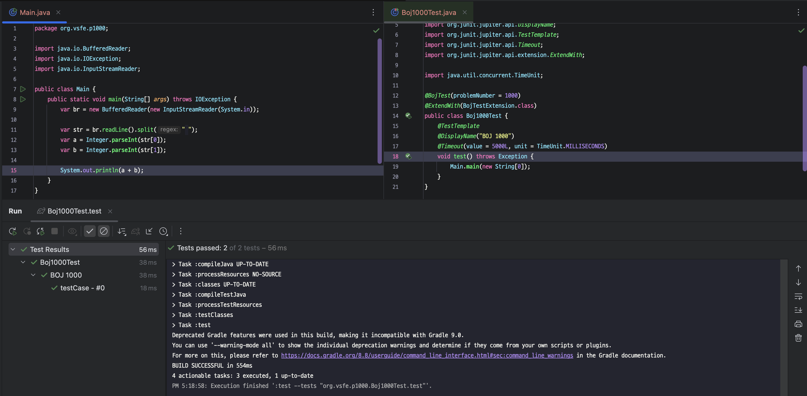

# BOJ-boot

## Introduction

- 백준 온라인 저지를 Java로 학습하는 분들을 위한 Helper 형태의 라이브러리/Gradle Plugin 입니다.
  - 프로젝트 구조 자동 설정, 테스트 케이스 및 테스트 코드 자동 등록등의 기능을 지원합니다.



- 라이브러리 (boj-commons), Gradle Plugin (boj-boot-plugin) 이 모두 존재하며, 함께 사용하는 것을 권장합니다.

## Installation

- **사용하는 프로젝트의 JDK 버전은 17 이상이어야 합니다.**
- (`build.gradle.kts` 기준) 다음과 같은 내용을 추가해 주세요.

```kotlin
buildscript {
    repositories {
        mavenCentral()
    }
    dependencies {
        classpath("io.github.vsfe:boj-boot-plugin:1.0.2")
    }
}

apply(plugin = "io.github.vsfe.boj-boot-plugin")

dependencies {
    implementation("io.github.vsfe:boj-commons:1.0.2")
}

```

- 또한, `settings.gradle.kts` (Groovy 사용 시 `settings.gradle`) 에 다음과 같은 내용을 추가해 주세요.

```kotlin
pluginManagement {
    repositories {
        mavenCentral()
        gradlePluginPortal()
    }
}
```

## How to use

```shell
# ./gradlew boj -PproblemNumber={problemNumber}
# ex - 1000번 문제에 대한 세팅이 필요한 경우
./gradlew boj -PproblemNumber=1000
```

- Main.java 파일은 `main/java/{basePackage}/p{problemNumber}/Main.java`  에 생성됩니다.
- Test 파일은 `test/{basePackage}/p{problemNumber}/Boj{problemNumber}Test.java` 로 생성 됩니다.
- Testcase 파일은 `test/resources/testcase/p{problemNumber}` 에 생성됩니다.
  - 기본적으로 백준 온라인 저지에 있는 예제 파일을 기반으로 생성되며, 필요한 경우 직접 추가가 가능합니다.
  - 직접 Testcase 추가를 희망하는 경우, `{testcaseNumber}.in`, `{testcaseNumber}.out` 파일을 생성하면 됩니다.
    - in: 입력 값, out: 출력 값

## FYI

- 각 문제의 Timeout은 백준 온라인 저지의 정책을 따라갑니다.
  - Java의 기본 시간 제한은 (시간 제한) * 2 + 1초 입니다. (https://help.acmicpc.net/language/info)
  - 만약, 문제에 (추가 시간 없음) 이라는 제한이 붙는 경우, 상단의 추가 시간 제한 정책은 무시됩니다.
  - 다만, 문제 하단에 각 언어별 고정 시간 제한 정책이 있는 경우, 해당 시간을 따라갑니다.
  - 설정된 Timeout 은 참고를 위해 추가된 것으로, 실제로는 백준 채점서버와 각자의 채점 환경의 런타임 차이를 감안해 주세요.

